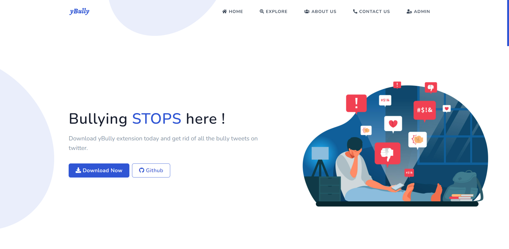
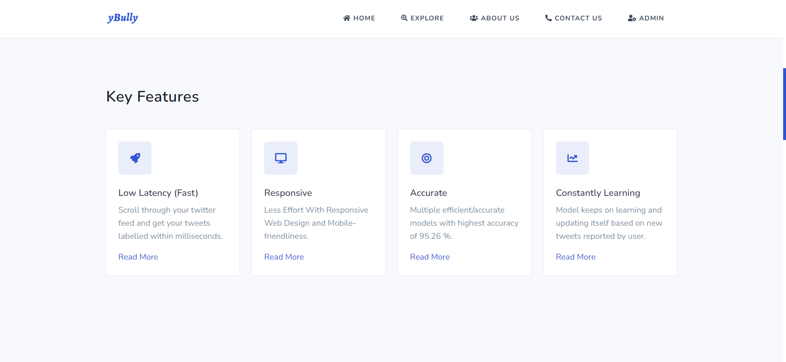
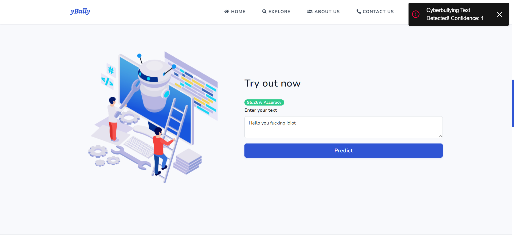

 

Table of contents
-----------------

* [Introduction](#introduction)
* [Deployment](#deployment)
* [Screenshots](#screenshots)
* [License](#license)

Introduction
-------------

yBully web is a landing page for users to learn about our extension, its features, trying out our trained models etc...

Deployment
----------

Deployed at [https://ybullyy.firebaseapp.com/](https://ybullyy.firebaseapp.com/).

Screenshots
-----

    
    
    
    

 

License
--------

Stargazers
-----------

 

